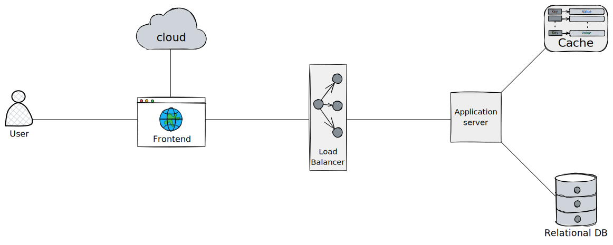
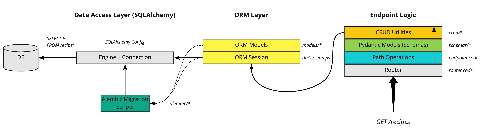

<p align="center">
    
</p>

Fileshare is a cloud storage application like Google Drive or Dropbox. Users can upload their files to a cloud server on one machine and then download them on another. 

---

# Overview
The purpose of this project is to experience the design considerations needing to be made in a microserviced application. Textbook definitions are great for describing theory and best practice but I always asked myself how these concepts (like availability or scalability) are implemented in real projects. I took it upon myself to create a containerized application to simulte a distributed architecture and solve for some of the real world problems teams encounter.

In this mock scenerio, a filesharing company needs to design an application that:
- Uploads files to the cloud with no restriction on filetype.
- Downloads file from the cloud.
- Supports a web client for interacting with files.

To get to market faster, their current focus is not on:
- Previewing files in the web client.
- Creating multiple versions of the same file and restoring files.
- Supporting mobile or desktop clients.

Below is a topology of the services being implemented.
<p align="center">
    
</p>

## Frontend
The frontend service is a TypeScript application built with the React framework, designed to provide an intuitive web interface for uploading, viewing, and downloading files. It also offers administrative capabilities, such as changing usernames and passwords. The frontend ensures that file content and metadata are correctly routed to their respective storage locations.

The frontend communicates directly with the storage server to facilitate client-side file manipulations, such as compression. This approach conserves valuable server-side resources as the user base grows, balancing client-side performance with server-side throughput efficiency.

### Generating Client Routes
The application frontend leverages [@hey-api/openapi-ts](https://heyapi.vercel.app/) to generate a REST client to interact with the REST API in our backend. This simple integration allows us to run a script called `openapi-ts` which parses our openapi.json file (found at `[domain]/api/v1/openapi.json` in our case) at the frontend root to do the code generation in TypeScript. Now, whenever we need to make a change to our REST API routes, we can download a new copy of openapi.json and run the script instead of making changes to the frontend client code.

## Storage
File contents are stored using [Localstack S3](https://docs.localstack.cloud/user-guide/aws/s3/), an emulator of AWS's Simple Storage Service (S3). While AWS S3 is subject to operational costs, Localstack's community edition offers a cost-effective alternative with comprehensive documentation and support. However, a notable limitation of the community edition is the lack of persistence in the S3 container, resulting in the loss of stored objects upon container restart.

Despite this, the development experience with Localstack is smooth, and many methods defined by the [AWS SDK](https://docs.aws.amazon.com/AWSJavaScriptSDK/v3/latest/client/s3/) are supported. For a detailed list of supported APIs, refer to the [coverage documentation](https://docs.localstack.cloud/references/coverage/coverage_s3/).

## Load Balancer
Application traffic needs to be distributed across multiple servers working in the backend to ensure high availability, reliability and performance by avoiding overloading a single server. An [Nginx](https://docs.nginx.com/nginx/admin-guide/load-balancer/http-load-balancer/) docker image configured as a load balancer is responsible for routing traffic from the frontend to the backend. 

In this scenerio, there is only one application server in the backend that accepts requests from the frontend so all traffic is being routed to that server. If at some point this changes, `nginx.conf` can be modified to direct traffic to the new server by making a small tweak to the upstream block. The load balancing algorithm can be changed as well to suit the needs of the application as it evolves.
```
upstream fileshare_backend {
    # Weighted Round Robin
    server backend1:8000 weight=3;
    server backend2:8100;
}
```

## Backend
The backend is powered by [FastAPI](https://fastapi.tiangolo.com/), which handles all requests for user data and file metadata. FastAPI is known for its speed in both request processing and development, thanks to its excellent documentation, detailed examples, and supportive community.

Supporting FastAPI in the backend are [SQLAlchemy](https://docs.sqlalchemy.org/en/20/) for object-relational mapping and [Pydantic](https://docs.pydantic.dev/latest/) for data validation. [Alembic](https://alembic.sqlalchemy.org/en/latest/) is used for data migrations, simplifying database configuration once the migration environment is set up.  It's as simple as defining your version scripts and using the command line interface to run the migration.

The backend architecture follows a modular design to separate concerns into distinct directories, enhancing maintainability and scalability. Key components include:

- CRUD Component: Performing CRUD operations on resources.
- API Component: Defining the REST API routes.
- Model Component: Defines ORM models for transactions with PostgreSQL.
- Schema Component: Validates application data with Pydantic models.

ChristopherGS created a great diagram that details the flow of data of a FastAPI application using SQLAlchemy, Pydantic and Alembic [^1]. 
<p align="center">
    
</p>

## Database
File metadata is stored using a PostgreSQL relational data store. The data we are going to be storing is very structured and has well defined relationships between entities. For example, we might store a user in the users table that has a one to many relationship between files in the file table. Both user and file have clear attributes we can define such as name, password or email for user and filename, size or extension for file.

You might be wondering why we are choosing to store the file contents in the cloud (S3) instead of using a data store on our backend. S3 has proven to be a very reliable and robust storage solution that has a ton of useful features such as resumable uploads and file versioning available out of the box. By separating these elements (metadata and contents) we are making a tradeoff between the dollar cost of storage in S3 and the performance cost of trying to deliver both the file contents and metadata.

## Cache
User data and file metadata is cached by Redis to prevent multiple database queries on frequently accessed items. A read-aside cache strategy is implemented to first check the cache for a hit and then the database on a miss before updating our cache. This has the advantage of lowering latency due to the design of Redis but adds another service that must be maintained.

## Requirements
- [Docker Desktop](https://www.docker.com/products/docker-desktop/)

## Installation
To build and run the application:
- Clone the repository on the main branch.
```
git clone git@github.com:reyncode/fileshare.git
```
- Navigate to the project root use docker compose to build the images and start the containers:
```
docker compose up -d
```
- In `backend` container, run the alembic migration by using the console in the `exec` tab:
```
alembic upgrade head
```

## Roadmap
- [ ] Improve the error handling differences between FilesStorageService and FilesMetadataService.
- [x] Refactor to leverage an openapi generation tool for changes to schemas.
- [ ] Implement file compression on the client side before uploading to S3.
- [ ] Implement a rollback feature in the event FilesStorage upload succeeds but FilesMetadata fails.

[^1]: [The Ultimate FastAPI Tutorial Part 7 - Database Setup with SQLAlchemy and Alembic](https://christophergs.com/tutorials/ultimate-fastapi-tutorial-pt-7-sqlalchemy-database-setup/)
